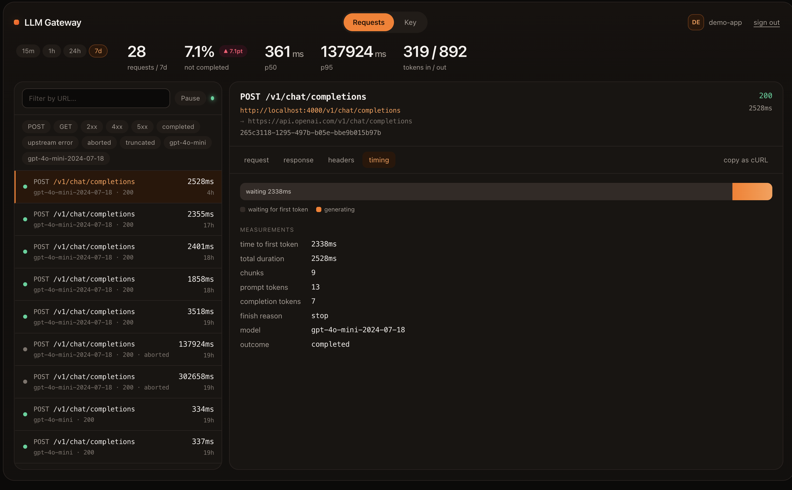
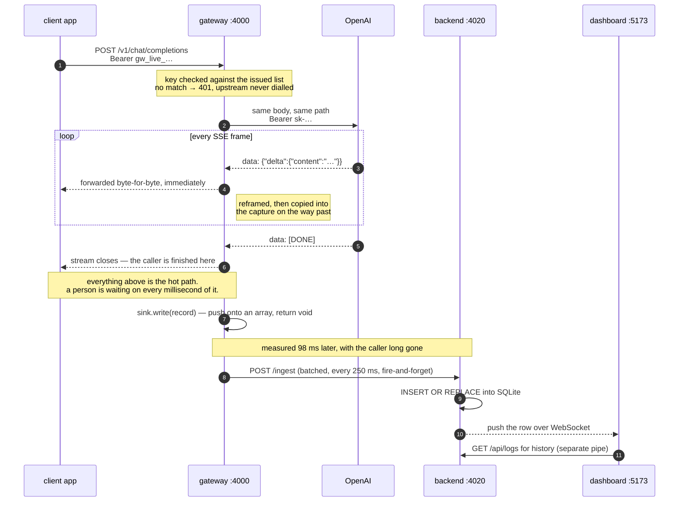
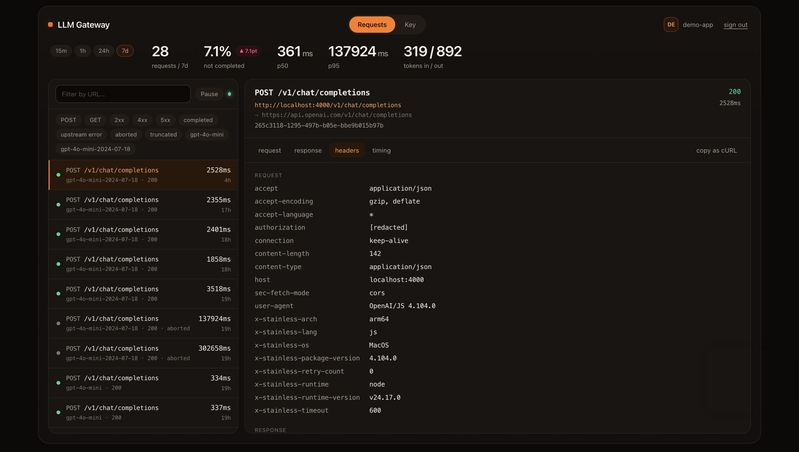

# LLM Gateway

An authenticating proxy in front of the OpenAI API that records every request
and response, streams the answer back untouched, and a dashboard for inspecting
the traffic live.



```
┌────────────┐  Authorization: Bearer gw_…  ┌──────────────┐  real OpenAI key  ┌────────────┐
│ client app │ ───────────────────────────► │   GATEWAY    │ ────────────────► │  OpenAI    │
│ (openai    │ ◄───────── SSE ───────────── │   :4000      │ ◄───── SSE ────── │  (or mock) │
│  SDK)      │                              └──────┬───────┘                   └────────────┘
└────────────┘                                     │ async batch POST /ingest
                                                   ▼
                                            ┌──────────────┐   WebSocket push   ┌────────────┐
                                            │ LOG BACKEND  │ ─────────────────► │ DASHBOARD  │
                                            │ :4020 SQLite │ ◄── REST queries ─ │   :5173    │
                                            └──────────────┘                    └────────────┘
```

The box diagram hides the decision the whole design turns on, which is *when*
each arrow fires rather than where it points:



The gateway never touches the database, the backend never talks to OpenAI, and
nothing on the second half of that diagram can fail in a way the caller can
feel. [`docs/architecture.html`](docs/architecture.html) has the same system as
a single page, with the failure modes and terminal states laid out beside it.

## Quick start

No OpenAI key, no Docker, no database, no global tooling. Node 22+ is the only
prerequisite — `node:sqlite` is built into the runtime, so nothing compiles at
install time.

```bash
npm install
npm run dev
```

That starts all four services — mock upstream, gateway, log backend, dashboard.

```bash
npm test         # 89 tests, ~11s, no network, no API key
npm run typecheck
```

Then walk the flow below.

Any OpenAI SDK works unchanged — point `baseURL` at `http://localhost:4000/v1`
and use a gateway key. To reach the real API, copy `.env.example` to `.env` and
set `UPSTREAM_BASE_URL=https://api.openai.com` with your `OPENAI_API_KEY`.

## Login and request inspection, end to end

Eight steps, about three minutes, no API key required — the mock upstream
answers everything.

**1. Start it.**

```bash
npm install
npm run dev
```

**2. Sign in.** Open **http://localhost:5173** and enter `gw_live_demo_key_1`.

There is no username and no password: the gateway key *is* the login. Whoever
holds a key owns the traffic made with it, which is exactly the boundary the
backend enforces. (Try a wrong key first — the error distinguishes "that key is
invalid" from "the backend is unreachable", because those need different
reactions.)

The **Key** tab shows who you are signed in as, that the secret is stored as a
SHA-256 hash, and the snippet for pointing a client at the gateway.

**3. Send a request.** In a second terminal:

```bash
npm run ask -- "what is a FIFO buffer?"
```

`examples/ask.mjs` is a real client: the official `openai` SDK with nothing
changed but `baseURL`. Tokens stream into your terminal as they arrive. When it
finishes it fetches the gateway's own log row and compares:

```
what the caller saw                what the gateway recorded
  characters received   1857         characters logged     1857
  chunks with content    378         chunks                 380
  time to first token   1468ms       time to first token   1435ms
✓ the text the caller received is byte-identical to the text logged
```

That is the answer to "how do I know the thing I am inspecting is the thing the
caller received?" — it is asserted, and the script exits non-zero if it fails.

**4. Watch it arrive.** The row appears in the dashboard *without a refresh*,
pushed over a WebSocket. The dot beside the search box is the connection state.

**5. Open it.** Click the row — or press `j` / `k` to move through the list.
Four tabs:

- **request** — the prompt, rendered as a conversation rather than raw JSON
- **response** — the reassembled assistant message
- **headers** — request and response, with `authorization` shown as `[redacted]`
- **timing** — waiting vs. generating, TTFT, chunk count, tokens in and out

The header carries both URLs and the request id, which is the same value the
gateway returned in `x-gateway-request-id`. **copy as cURL** yields a command
you can paste and re-run.

**6. Filter.** Chips for method, status class, outcome and model; free text
matches the URL; `15m / 1h / 24h / 7d` sets the window. Filters live in the query
string, so any view is a shareable link — and they are applied server-side, so a
filtered view stays live.

**7. Prove the tenancy boundary.** Send traffic as a different key:

```bash
GATEWAY_API_KEY=gw_live_demo_key_2 npm run ask -- "a question from another app"
```

Sign out, sign in as `gw_live_demo_key_2`: you see that request and none of the
first key's. Sign back in as key 1 and it is the reverse. Two applications, one
gateway, one upstream key funding both, neither able to read the other's
prompts. Fetching another key's record by id returns `404`, not `403` — you
cannot even learn it exists.

**8. Prove logging cannot take the proxy down.** With the stack running, kill
just the log backend:

```bash
lsof -ti:4020 | xargs kill -9
npm run ask -- "does the gateway still work?"
```

The answer still streams. The dashboard says so in words rather than going
quietly still, and reconnects on its own when the backend returns. If the
gateway's queue overflows while it is away, the dashboard reports how many
records were lost — silent log loss is the failure mode of every buffered
logging system, and this one is not silent.

To do all of the above against the real OpenAI API instead of the mock, set
`UPSTREAM_BASE_URL=https://api.openai.com` and `OPENAI_API_KEY` in `.env`.

## Requirements

| From the brief | Where | Proven by |
|---|---|---|
| Capture method, URL, headers, body | `gateway/src/app.ts` | `logging.test.ts` |
| Response status, headers, body, latency | `gateway/src/capture.ts` | `logging.test.ts` |
| Logs shipped asynchronously to the backend | `gateway/src/sink.ts` → `backend/src/app.ts` | `sink-isolation.test.ts` |
| Streaming via Server-Sent Events | `gateway/src/sse.ts`, `app.ts` | `streaming-timing.test.ts`, `sse.test.ts` |
| Authenticate to the gateway via API key | `shared/src/keys.ts` | `auth.test.ts` |
| Logs and metadata stored per API key | `backend/src/db.ts` | `backend.test.ts` (tenancy) |
| Real-time stream of requests | `backend/src/ws.ts`, `dashboard/src/lib/useLiveLogs.ts` | screenshot below |
| Click through to full detail | `dashboard/src/routes/RequestDetail.tsx` | screenshot below |
| Filter by method, status, URL substring | `dashboard/src/routes/Requests.tsx` | `backend.test.ts` (filters) |

Two URLs are recorded, not one. A proxy sits between two requests: `url` is what
the caller asked the gateway for — the intercepted request, and what the URL
filter searches and "copy as cURL" reproduces — and `upstreamUrl` is where the
gateway forwarded it. Every upstream shares the same paths, so without the
second there is nothing to say whether a call reached OpenAI or the local mock.

## The problem worth describing

Everything here is ordinary CRUD except one thing: a streamed response is not a
body, it is a connection held open for tens of seconds dribbling tokens. Buffer
it in order to log it and the caller's UI stops streaming — the feature the
gateway exists to support is the feature it destroys. Forward it untouched and
there is nothing to log.

The resolution is to observe events as they pass rather than collect them:

```ts
const out = new ReadableStream({
  async pull(controller) {
    const { done, value } = await reader.read();
    for (const event of reframer.push(value)) {
      if (capture.observe(event)) controller.enqueue(encode(event));
    }
  },
  cancel() { capture.aborted = true; reader.cancel(); finish(); },
});
```

Three decisions are packed into that:

**Pull-driven, not a `TransformStream`.** `tee()` was the first instinct and it
is worse here: it creates two consumers of one source, so the stream runs at the
speed of the slower branch and an unconsumed branch deadlocks it outright. A
pull-driven readable has one consumer, so back-pressure runs from the caller's
socket to the upstream connection, and `cancel` gives an explicit hook that
`TransformStream` does not — which is how a caller hanging up becomes
`client_aborted` instead of an anonymous stream error.

**`observe` is on the hot path, so it does almost nothing.** Reframe, parse,
append, stamp a timestamp. Record assembly happens after the last byte is on the
wire. The test that enforces this asserts the sink is called exactly once per
request.

**Log shipping sits behind an interface.** `LogSink.write` is synchronous and
must never throw. A sink that blocks the event loop for 300ms does not move the
caller's per-chunk timings, and a sink that throws does not break the response —
both are asserted, because both are the actual claim being made.

## Five things that are easy to get wrong

**A streamed failure is still `200 OK`.** The status is committed before the
body exists, so a stream that dies at token 400 looks successful. The gateway
derives its own verdict — `completed` / `client_aborted` / `upstream_error` /
`truncated` — from whether `[DONE]` arrived, whether an error object appeared
in-band, and whether the caller left. In the screenshot above, the top row is a
`200` marked `upstream error`; filtering on that state answers a question
OpenAI's own status codes cannot.

**Streams carry no token usage.** Not unless the request sets
`stream_options.include_usage`. Rather than log zeros on exactly the calls people
most want to measure, the gateway adds the flag, reads the usage chunk, and
removes that chunk again if the caller did not ask for it — so usage is exact and
the caller's stream is unchanged. This is the one place the proxy is not
byte-transparent, it is disclosed here rather than buried, and
`injectUsage: false` turns it off.

**TCP does not respect message boundaries.** One read can hold half an event,
three events, or a cut through the middle of a 4-byte emoji. `SseReframer` is the
only component that has to know this; it decodes with `{ stream: true }` so a
split character does not silently corrupt the log, and it emits original event
text so forwarding re-encodes to the exact bytes that arrived.

**A client that hangs up is still being billed.** The caller's `AbortSignal` is
passed to the upstream `fetch`, and `cancel` cancels the upstream body. The test
asserts the mock stopped generating, not merely that the gateway returned.

**A `pull` that enqueues nothing ends the stream.** This one cost most of a day
and is worth stating plainly, because nothing about it is obvious.

A `ReadableStream` schedules `pull` again when a chunk is enqueued, when a new
read arrives, or when the stream closes — and otherwise not at all. So a `pull`
that reads bytes, finds it is holding half an SSE frame, and resolves without
enqueuing *ends the pull chain permanently*. The stream is still `readable`,
`desiredSize` is still positive, nothing has failed, and no further call will
ever come. There is no error to catch and nothing in any log.

Every test passed, and the first call to the real API hung after one token. The
gateway had stopped reading from upstream and sat there until undici's
300-second body timeout ended it. It was invisible against the mock because the
mock wrote one whole frame per chunk, so every pull enqueued something. Against
`api.openai.com`, TCP splits a frame within the first few reads and the gateway
deadlocks — a failure mode that is *probabilistic in response length*, so a
short smoke test passes and real traffic hangs.

Two ordinary things produce a read with nothing to forward: a frame split across
reads, and the usage chunk the gateway requests and strips. So `pull` now loops
until it has something to hand over. The mock grew an `x-mock-split-at` header so
it can be as rude as a real socket, and `streaming-frames.test.ts` hangs without
the fix — verified by putting the bug back.

The general lesson is the one the whole test suite is built on: *a proxy is only
tested by an upstream that is allowed to be inconvenient.*

## The dashboard



The gateway key *is* the login: whoever holds it owns the traffic made with it,
which is exactly the boundary the backend enforces.

Three details are deliberate rather than incidental:

- **Rows are buffered and flushed every 200ms.** Busy traffic arrives faster than
  React should re-render; one update per tick keeps the table readable.
- **Pause stops rows being prepended, not the socket.** An auto-scrolling table is
  unusable the moment you try to click a row in it, and the backlog is still
  there when you resume.
- **Filters are pushed to the server**, which applies the same predicate its SQL
  uses. A filtered view stays live without shipping rows the browser would
  discard — and without rows appearing that would vanish on refresh. That shared
  predicate has its own test.
- **The time window travels as a duration, not a timestamp.** An anchored
  `since` would freeze "the last hour" at the moment the chip was clicked and go
  stale while you watched it; sending `windowMs` lets the server resolve it
  against its own clock on every query.
- **Two silences are named rather than left to interpretation.** A backend that
  went away and a queue that overflowed both look like "no traffic" in a live
  table. Each gets a banner saying which it is, because an inspector that
  quietly under-reports is worse than one that is obviously down.

Filters live in the query string, so a filtered view is a shareable link.

## Tenancy

`api_key_id` is the isolation boundary, and it is enforced in one place rather
than sprinkled through the handlers. Note what is *missing* from the API: no
endpoint accepts an `api_key_id` parameter. The only way to say which logs you
want is to prove which key you hold, so there is no version of these handlers
that can be talked into crossing tenants. Fetching another key's record by id
returns `404`, not `403` — you cannot even learn it exists.

The WebSocket carries the key as a **subprotocol**, not a query parameter.
Browsers cannot set headers on a WS handshake, so `?key=…` is the usual
shortcut — and then the key is in access logs, proxy logs and browser history.

## Tradeoffs

| Decision | Why | What it costs |
|---|---|---|
| SQLite via built-in `node:sqlite` | `npm install && npm run dev`, no server, no container, no native build step | single writer, single node; real log volume wants ClickHouse or Timescale, with Postgres as a stop on the way |
| Gateway and backend as separate processes | the proxy must not be slowed or taken down by the logging path | more moving parts than one process |
| Bounded in-memory queue for log shipping | no broker to install; back-pressure is explicit and drops are counted, not silent | at-most-once on crash — the queue is lost. Retries make delivery at-least-once, which `INSERT OR REPLACE` on the caller-supplied id turns back into effectively-once |
| Pull-driven readable over `tee()` | one consumer, real back-pressure, an explicit cancel hook | the observer runs on the hot path, so it must stay trivial |
| Inject `include_usage`, strip the chunk | exact token counts without changing what the caller sees | the proxy is no longer purely transparent |
| Full bodies stored, truncated at 256 KB | inspecting them is the entire point of the tool | prompts are user data; production needs retention limits, field-level redaction and encryption at rest |
| SHA-256 for keys, not bcrypt | 128+ bits of random, checked on every request; a slow KDF adds latency and buys nothing against an unguessable secret | wrong choice entirely for human-chosen passwords |
| Header allowlists in both directions | a header nobody thought about leaks nothing | an unusual header needs an explicit addition |
| Plain CSS, no component library | a devtool is tables and chips; one stylesheet is less machinery than a design system | no theming story beyond CSS variables |

## Verification

The interesting tests check the claim rather than the code.

Every mock chunk carries the timestamp it was emitted at, so `arrived - emitted`
is the gateway's transit cost for that chunk. Two shapes are possible: streaming
produces a small **flat** overhead across all chunks; buffering produces an
overhead equal to the whole generation time on chunk 0, decaying to zero on the
last. A flat line is the proof, and nothing else produces one.

| Test | What it proves |
|---|---|
| `streaming-timing` — flat overhead | per-chunk spread < 100ms where buffering would be ~440ms |
| `streaming-timing` — slow tail | first chunk delivered in < 300ms of a stream taking over a second |
| `sink-isolation` — blocking sink | a sink blocking 300ms does not move caller timings; called exactly once |
| `sink-isolation` — throwing sink | a logging failure never becomes a caller-facing failure |
| `sse` — split multi-byte char | an emoji cut across two reads is not corrupted in the log |
| `logging` — in-band error | `terminal_state = upstream_error` on a `200 OK` stream |
| `logging` — client disconnect | the upstream stopped generating, not just the gateway |
| `logging` — usage | exact tokens captured, caller's stream unchanged |
| `logging` — redaction | neither the caller's key nor the upstream key appears in a stored record |
| `streaming-frames` — split frames | a frame split across reads still reaches the caller; hangs without the fix |
| `logging` — URLs | the caller's URL and the upstream URL are both recorded, query strings intact |
| `sink-http` — overflow | the oldest records are dropped, and the count reaches the dashboard |
| `sink-http` — dead backend | `write` never throws, whatever the backend is doing |
| `backend` — tenancy | key A cannot list or fetch key B's logs; unknown key is 401 |
| `backend` — idempotent ingest | a retried batch does not duplicate rows |
| `backend` — filters, pagination | each filter and the keyset cursor behave |
| `backend` — time window | relative, clamped, and ignored when nonsense |
| `backend` — live predicate | the WS filter agrees with the SQL filter |

Back-pressure is deliberately not asserted end-to-end; the comment in
`logging.test.ts` explains why a test written against the mock would measure the
mock's HTTP adapter rather than the gateway, and what is asserted instead.

## Layout

```
packages/
  shared/        LogRecord + view types (the contract) and key hashing
  mock-openai/   metronome upstream: timestamped SSE, controllable failures
  gateway/       the proxy
    src/sse.ts       reframes bytes into whole SSE events
    src/capture.ts   accumulates the log record as events fly past
    src/sink.ts      LogSink interface + memory and HTTP implementations
    src/app.ts       the proxy itself
  backend/       ingest, SQLite store, query API, WebSocket fan-out
  dashboard/     React + Vite
    src/routes/      Login, Requests (live table + filters), RequestDetail, Keys
    src/lib/         API client, the live feed hook, formatting
examples/
  ask.mjs        a real client: streams an answer, then checks it against the log
```

## Scaling

The proxy tier scales by buying machines — it is stateless already. The logging
plane does not, in its current shape: one stored record per request is 4 GB/s
and 345 TB/day at a million requests per second, and no choice of database fixes
that. The answer is to split metrics (aggregated, every request, forever) from
traces (sampled, full fidelity, short retention), which is worth roughly 100x
before any infrastructure changes.

Two findings from working that through are already fixed here, because they were
cheap and real:

- **The first ceiling was 200 records/sec** — one batch of 50 every 250ms, one
  request in flight. The sink now runs several batches concurrently, since the
  limit is round-trip latency rather than bytes. A test asserts the concurrency
  rather than trusting the constant.
- **Batch inserts now run in one transaction.** Each row was previously its own
  implicit transaction and its own WAL commit.

## Further work

Per-key rate limits and budgets; provider fan-out behind one OpenAI-shaped API;
response caching; session/trace grouping so a whole agent run reads as one tree
instead of forty loose rows; PII scrubbing before storage; OpenTelemetry export;
a retention policy, because storing full prompts forever is a liability.

## AI assistance

_(Describe here how Copilot / Claude / ChatGPT were used — the brief asks, and a
straight answer reads better than a vague one.)_
