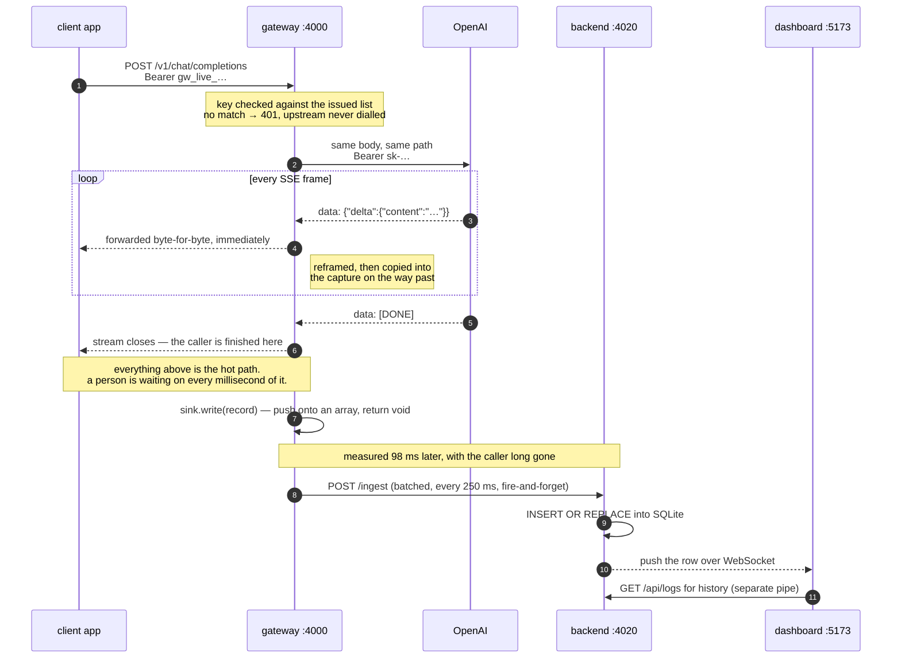

# LLM Gateway

An authenticating proxy in front of the OpenAI API that records every request
and response, streams the answer back untouched, and a dashboard for inspecting
the traffic live.


Client apps point their OpenAI SDK at the gateway instead of `api.openai.com`.
The gateway checks their *gateway* key, forwards the call with the *real* key
held server-side, streams the answer straight back — and, off the hot path,
records what happened.



The gateway never touches the database and the backend never talks to OpenAI, so
nothing on the second half of that diagram can fail in a way the caller feels.
[`docs/architecture.html`](docs/architecture.html) lays the same system out as a
single page, with the failure modes and terminal states beside it.

## Quick start

No OpenAI key, no Docker, no database, no global tooling. Node 22+ is the only
prerequisite — `node:sqlite` is built into the runtime, so nothing compiles at
install time.

```bash
npm install
npm run dev      # mock upstream, gateway, log backend, dashboard
```

Open **http://localhost:5173** and sign in with `gw_live_demo_key_1`. Then, in a
second terminal:

```bash
npm run ask -- "what is a FIFO buffer?"
```

```bash
npm test         # 89 tests, ~11s, no network, no API key
npm run typecheck
```

Any OpenAI SDK works unchanged — point `baseURL` at `http://localhost:4000/v1`
and use a gateway key. To reach the real API, copy `.env.example` to `.env` and
set `UPSTREAM_BASE_URL=https://api.openai.com` with your `OPENAI_API_KEY`.

## What the brief asked for

| From the brief | Where | Proven by |
|---|---|---|
| Capture method, URL, headers, body | `gateway/src/app.ts` | `logging.test.ts` |
| Response status, headers, body, latency | `gateway/src/capture.ts` | `logging.test.ts` |
| Logs shipped asynchronously | `gateway/src/sink.ts` → `backend/src/app.ts` | `sink-isolation.test.ts` |
| Streaming via Server-Sent Events | `gateway/src/sse.ts`, `app.ts` | `streaming-timing.test.ts`, `sse.test.ts` |
| Authenticate via API key | `shared/src/keys.ts` | `auth.test.ts` |
| Logs stored per API key | `backend/src/db.ts` | `backend.test.ts` (tenancy) |
| Real-time stream of requests | `backend/src/ws.ts`, `dashboard/src/lib/useLiveLogs.ts` | the screenshot above |
| Click through to full detail | `dashboard/src/routes/RequestDetail.tsx` | the screenshot below |
| Filter by method, status, URL substring | `dashboard/src/routes/Requests.tsx` | `backend.test.ts` (filters) |

Two URLs are recorded, not one. A proxy sits between two requests: `url` is what
the caller asked the gateway for — what the URL filter searches and what "copy as
cURL" reproduces — and `upstreamUrl` is where it was forwarded. Every upstream
shares the same paths, so without the second there is nothing to say whether a
call reached OpenAI or the local mock.

## Tradeoffs

| Decision | Why | What it costs |
|---|---|---|
| SQLite via built-in `node:sqlite` | `npm install && npm run dev`, no server, no container, no native build | single writer, single node; real volume wants ClickHouse or Timescale |
| Gateway and backend as separate processes | the proxy must not be slowed or taken down by the logging path | more moving parts than one process |
| Bounded in-memory queue for log shipping | no broker to install; back-pressure explicit, drops counted rather than silent | at-most-once on crash. Retries make delivery at-least-once, which `INSERT OR REPLACE` on the caller-supplied id turns back into effectively-once |
| Log the stream by watching it, never buffering it | each token reaches the caller the moment it arrives; back-pressure and cancellation both work end to end | the log record is assembled inside the response path, so that work must stay trivial — anything expensive waits until the last byte is sent |
| Inject `include_usage`, strip the chunk | exact token counts without changing what the caller sees | the proxy is no longer purely transparent |
| Full bodies stored, truncated at 256 KB | inspecting them is the entire point of the tool | prompts are user data; production needs retention limits, field-level redaction, encryption at rest |
| SHA-256 for keys, not bcrypt | 128+ bits of random checked on every request; a slow KDF adds latency and buys nothing against an unguessable secret | wrong choice entirely for human-chosen passwords |
| Header allowlists in both directions | a header nobody thought about leaks nothing | an unusual header needs an explicit addition |
| Plain CSS, no component library | a devtool is tables and chips; one stylesheet is less machinery than a design system | no theming story beyond CSS variables |

## Tenancy

`api_key_id` is the isolation boundary, enforced in one place rather than
sprinkled through the handlers. Note what is *missing* from the API: no endpoint
accepts an `api_key_id` parameter. The only way to say which logs you want is to
prove which key you hold, so there is no version of these handlers that can be
talked into crossing tenants. Fetching another key's record by id returns `404`,
not `403` — you cannot even learn it exists.

The WebSocket carries the key as a **subprotocol**, not a query parameter.
Browsers cannot set headers on a WS handshake, so `?key=…` is the usual shortcut
— and then the key is in access logs, proxy logs and browser history.

## The dashboard


The gateway key *is* the login: whoever holds it owns the traffic made with it,
which is exactly the boundary the backend enforces.

- **Rows are buffered and flushed every 200ms.** Busy traffic arrives faster than
  React should re-render; one update per tick keeps the table readable.
- **Pause stops rows being prepended, not the socket.** An auto-scrolling table is
  unusable the moment you try to click a row in it, and the backlog is still
  there when you resume.
- **Filters are pushed to the server**, which applies the same predicate its SQL
  uses. A filtered view stays live without shipping rows the browser would
  discard — and without rows appearing that would vanish on refresh. That shared
  predicate has its own test. Filters live in the query string, so any view is a
  shareable link.
- **The time window travels as a duration, not a timestamp.** An anchored `since`
  would freeze "the last hour" at the moment the chip was clicked; sending
  `windowMs` lets the server resolve it against its own clock every query.
- **Two silences are named rather than left to interpretation.** A backend that
  went away and a queue that overflowed both look like "no traffic" in a live
  table. Each gets a banner saying which, because an inspector that quietly
  under-reports is worse than one that is obviously down.

## Verification

The interesting tests check the claim rather than the code. Two claims carry the
project: that a streamed answer reaches the caller as it arrives rather than
being held back so it can be logged, and that logging can never slow a request
or fail one.

Every mock chunk carries the timestamp it was emitted at, so `arrived - emitted`
is the gateway's transit cost for that chunk. Two shapes are possible: streaming
produces a small **flat** overhead across all chunks; buffering produces an
overhead equal to the whole generation time on chunk 0, decaying to zero on the
last. A flat line is the proof, and nothing else produces one.

| Test | What it proves |
|---|---|
| `streaming-timing` — flat overhead | per-chunk spread < 100ms where buffering would be ~440ms |
| `sink-isolation` — blocking sink | a sink blocking 300ms does not move caller timings; called exactly once |
| `sink-isolation` — throwing sink | a logging failure never becomes a caller-facing failure |
| `streaming-frames` — split frames | a frame split across reads still reaches the caller; hangs without the fix |
| `sse` — split multi-byte char | an emoji cut across two reads is not corrupted in the log |
| `logging` — in-band error | a stream that fails *after* its `200 OK` is recorded as `upstream_error`, not a success |
| `logging` — client disconnect | the upstream stopped generating, not just the gateway |
| `logging` — redaction | neither the caller's key nor the upstream key appears in a stored record |
| `sink-http` — overflow | the oldest records are dropped, and the count reaches the dashboard |
| `backend` — tenancy | key A cannot list or fetch key B's logs; unknown key is 401 |
| `backend` — idempotent ingest | a retried batch does not duplicate rows |
| `backend` — live predicate | the WS filter agrees with the SQL filter |

Twelve of 89. The rest cover usage capture, both URLs, filters, keyset
pagination, time windows, config validation and cURL generation. Back-pressure is
deliberately *not* asserted end-to-end; the comment in `logging.test.ts` explains
why a test written against the mock would measure the mock's HTTP adapter rather
than the gateway, and what is asserted instead.

## Walk it yourself

Eight steps, about three minutes, no API key required.

**1–2. Start it and sign in.** `npm run dev`, then
**http://localhost:5173** with `gw_live_demo_key_1`. There is no username and no
password. Try a wrong key first — the error distinguishes "that key is invalid"
from "the backend is unreachable", because those need different reactions.

**3. Send a request.** `npm run ask -- "what is a FIFO buffer?"`

`examples/ask.mjs` is a real client: the official `openai` SDK with nothing
changed but `baseURL`. Tokens stream into your terminal as they arrive, and when
it finishes it fetches the gateway's own log row and compares:

```
what the caller saw                what the gateway recorded
  characters received   1857         characters logged     1857
  chunks with content    378         chunks                 380
  time to first token   1468ms       time to first token   1435ms
✓ the text the caller received is byte-identical to the text logged
```

That answers "how do I know the thing I am inspecting is the thing the caller
received?" — it is asserted, and the script exits non-zero if it fails.

**4–6. Watch, open, filter.** The row appears without a refresh, pushed over a
WebSocket — the dot beside the search box is the connection state. Click it, or
press `j` / `k`. Four tabs: **request** (the prompt as a conversation, not raw
JSON), **response**, **headers** (`authorization` shown as `[redacted]`),
**timing** (waiting vs. generating, TTFT, chunks, tokens). The header carries
both URLs and the request id — the same value returned in
`x-gateway-request-id` — and **copy as cURL** yields a runnable command. Filter
with chips for method, status class, outcome and model; free text matches the
URL; `15m / 1h / 24h / 7d` sets the window.

**7. Prove the tenancy boundary.** Send traffic as a second key, then sign in as
it: you see that request and none of the first key's.

```bash
GATEWAY_API_KEY=gw_live_demo_key_2 npm run ask -- "a question from another app"
```

Two applications, one gateway, one upstream key funding both, neither able to
read the other's prompts.

**8. Prove logging cannot take the proxy down.** Kill just the log backend, then
send another request — the answer still streams.

```bash
lsof -ti:4020 | xargs kill -9
npm run ask -- "does the gateway still work?"
```

The dashboard says it is offline in words rather than going quietly still, and
reconnects on its own. If the queue overflows while it is away, it reports how
many records were lost — silent log loss is the failure mode of every buffered
logging system, and this one is not silent.

## Layout

```
packages/
  shared/        LogRecord + view types (the contract) and key hashing
  mock-openai/   metronome upstream: timestamped SSE, controllable failures
  gateway/       the proxy
    src/sse.ts       reframes bytes into whole SSE events
    src/capture.ts   accumulates the log record as events fly past
    src/sink.ts      LogSink interface + memory and HTTP implementations
    src/app.ts       the proxy itself
  backend/       ingest, SQLite store, query API, WebSocket fan-out
  dashboard/     React + Vite
    src/routes/      Login, Requests (live table + filters), RequestDetail, Keys
    src/lib/         API client, the live feed hook, formatting
examples/
  ask.mjs        a real client: streams an answer, then checks it against the log
```
